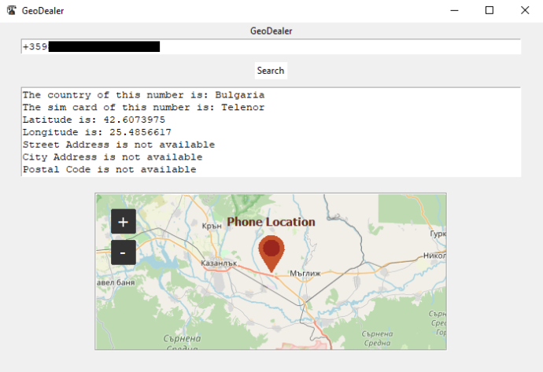

# GeoDealer

GeoDealer is a Python application for retrieving information about phone numbers, including location and service provider details.
<br>

<br>
## Prerequisites

- Python 3.x
- Tkinter
- phonenumbers library
- opencage library
- tkintermapview library

## Installation

1. Clone this repository.
2. Install required libraries:

   ```bash
   pip install phonenumbers opencage-python-client tkintermapview
   ```
3. In `config.json` set your OpenCage API key / https://opencagedata.com/

## Features
- Parses phone numbers, retrieves location & service provider data.
- Uses OpenCage API for geocoding.
- Displays location on a map.

### Credits
Created by Young-Zerka (bokluk0).
